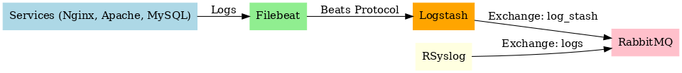

# 📦 Log Forwarding Pipeline: Filebeat → Logstash → RabbitMQ

This repository provides a complete guide to set up a log forwarding system using Filebeat and Logstash, sending logs to a RabbitMQ message queue.

---

## 🖼️ Architecture Diagram



---

## 📘 Overview

This pipeline allows:
- Filebeat to collect logs from files and Docker containers on multiple servers
- Logstash to process and forward those logs to a RabbitMQ broker
- RabbitMQ to queue logs for downstream processing (e.g., log analysis, storage, alerts)

> 🔄 Note: **Filebeat** must be installed on **all servers**, while **Logstash** runs on the RabbitMQ host or central processor node.

---

## 📦 A) Installing and Configuring Filebeat

### 1. Add Elastic GPG Key

```bash
curl -fsSL https://artifacts.elastic.co/GPG-KEY-elasticsearch | sudo gpg --dearmor -o /usr/share/keyrings/elasticsearch-archive-keyring.gpg
```

### 2. Add APT Repository

```bash
echo "deb [signed-by=/usr/share/keyrings/elasticsearch-archive-keyring.gpg] https://artifacts.elastic.co/packages/8.x/apt stable main" | sudo tee /etc/apt/sources.list.d/elastic-8.x.list
```

### 3. Update APT and Install Filebeat

```bash
sudo apt-get update
sudo apt-get install filebeat
```

### 4. Start and Enable Filebeat

```bash
sudo systemctl start filebeat
sudo systemctl enable filebeat
```

### 5. Configure Filebeat

Edit `/etc/filebeat/filebeat.yml`:

```yaml
filebeat.inputs:
- type: log
  enabled: true
  paths:
    - /var/log/apache.log
    - /var/log/mysql/error.log
    - /var/log/zabbix/zabbix_server.log
    - /var/log/pods

- type: container
  enabled: true
  tags: ["docker"]
  paths:
    - /var/lib/docker/containers/*/*.json

output.logstash:
  hosts: ["<logstash-running-server-IP>:5044"]
```

Then:

```bash
sudo systemctl restart filebeat
filebeat test config
```

---

## ⚙️ B) Installing and Configuring Logstash

### 1. Install Logstash

```bash
sudo apt-get install logstash
```

### 2. Create a Logstash Pipeline Config

```bash
sudo vim /etc/logstash/conf.d/beats-to-rabbitmq.conf
```

Add:

```ruby
input {
  beats {
    port => 5044
  }
}

output {
  rabbitmq {
    host => "<rabbit-server-IP>"
    port => "5672"
    user => "name"
    password => "password"
    vhost => "/"
    exchange => "direct"
    durable => true
    persistent => true
  }
}
```

### 3. Start and Enable Logstash

```bash
sudo systemctl start logstash
sudo systemctl enable logstash
sudo systemctl restart logstash
```

---

## ✅ Summary

- Filebeat collects logs (standard + container logs)
- Sends to Logstash on port 5044
- Logstash forwards to RabbitMQ using exchange `"direct"`
- Modular, scalable and great for log centralization & processing

---

> Feel free to contribute with improvements or monitoring integrations like Prometheus/Grafana!

